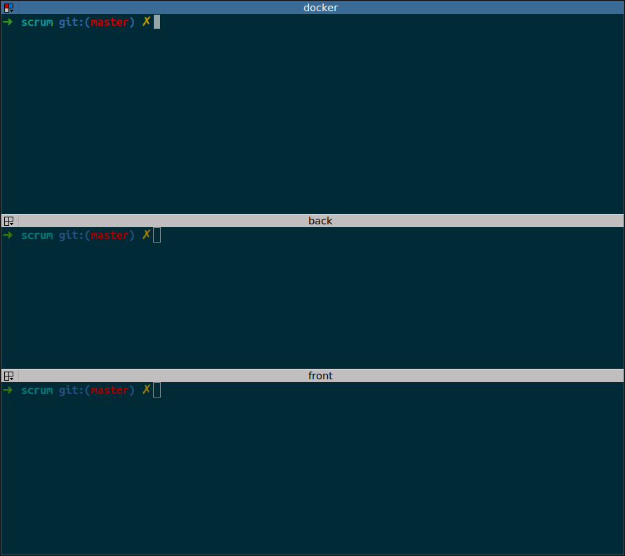

# WIP: Simple scrum daily stand-up tool

## How to run
```bash
# install dependencies
yarn install
```




## Roadmap

- Make a real authentication
    - Add OAuth2 strategy to passport.js
- Create a user interface
    - Entry CRUD
    - List of entries by user
    - List of users
